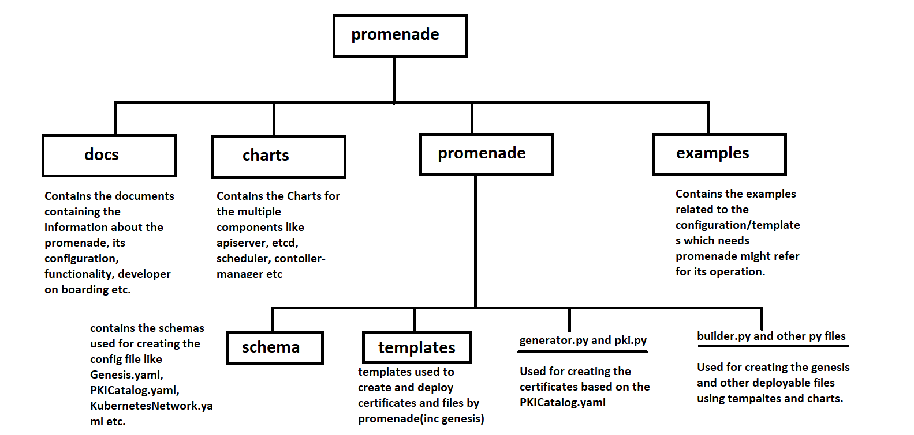

# Airship in a Bottle

## 1. Problem Statement

The activity was to be able to deploy “Airship in a Bottle” with following tasks to be completed while performing the activity: -

**Task 1.** Use kubeadm, kubectl, kubeadm binaries. Don't use apt to install these packages.

**Task 2.** Setup a local ubuntu repo to install other packages if required. Don't directly install packages from ubuntu mirrors or any other public repos.

**Task 3.** Don’t use any docker images from public repos (e.g.: quay.io, dockerhub.com, gcr.io etc.). Setup a local docker images registry for docker images. 

**Task 4.** Modify airship manifest(s) to use the docker images and other packages from local repos and registries.  

**Task 5.** Write the script to automate whole process in any language (Golang is preferred though). Try to make the deployment as automated as possible.

Following link was provided: -

https://github.com/airshipit/treasuremap

## 2. Activities

To accomplish this, plan was to perform the above-mentioned tasks independently and once all the tasks are completed, to combine them together to get the complete solution. 

The critical area of this planning was to understand and then to be able to deploy the Airship in a bottle using the kubeadm.

Following tasks were performed to accomplish the solution.

**Task 1.** A separate Cluster was created using the kubeadm and kubectl binaries (without the usage of the apt to install the packages). Refer the section **Cluster creation without using the kubeadm binaries** for more details on the steps performed for achieving this task.

**Task 2.** Local ubuntu repository was also comprising of all the packages required for the deployment of the Airship in a Bottle. For this dpkg-dev was used. Refer section **Local Ubuntu Repository Creation** for more details about the steps performed.

**Task 3.** Local Docker Registry was created on a separate machine comprising of all the required images. Steps for creating the Docker Registry are captured under the section **Docker Registry Creation**.

**Task 4a.** The focus area of the task was to understand what Airship is and try to be familiar with the Treasure Map link provided. Based on the understanding multiple approaches were tried to deploy “Airship in a Bottle” using the kubeadm. 
Various approaches undertaken to understand and deploy “Airship in a bottle” are covered under section **Airship understanding and Deployment**.

**Task 4b.** Deployed the “Airship in a Bottle” using the method defined in the treasuremap. This Airship accessed the local Docker Registry and local Ubuntu Repository for the iamges and the binaries. Refer section **Airship in a Bottle using local docker registry and Ubuntu Repository** for the steps executed and changes done to make it run.


## 3. Cluster creation without using the Kubeadm Binaries

### 3.1 Pre-Requisite

1.	2 Ubuntu 16.04 virtual machines, with 2 GB RAM, 2 vCPUs and 10 GB storage
2.	Host Network configured with SSH daemon running
3.	Packages like curl are installed on the machine.

NOTE: - This task was tested as a stand-alone task hence the dependent packages were installed from the Ubuntu mirror and not from the Local Repository.

### 3.2 Steps Performed

Choose one node to be a Master and login to the same. 

1.	Switch to the root user.

	```
	$ sudo su -
	```
2.	Swap was turned off
	```
	$ swapoff -a
	```
3.	Install the docker.io package using the following command.
	```
	$ apt-get install docker.io
	```
4.	All the dependent packages were installed
	```
	$ apt-get install iproute2 socat util-linux mount ebtables ethtool conntrack
	```
5.	Create a folder for the storing the binaries
	```
	$ mkdir kube_binaries

	$ cd kube_binaries
	```
6.	Download the required binaries and install them
	```
	$ curl -LO https://packages.cloud.google.com/apt/pool/kubernetes-cni_0.7.5-00_amd64_b38a324bb34f923d353203adf0e048f3b911f49fa32f1d82051a71ecfe2cd184.deb
	
	$ dpkg -i kubernetes-cni_0.7.5-00_amd64_b38a324bb34f923d353203adf0e048f3b911f49fa32f1d82051a71ecfe2cd184.deb

	$ curl -LO https://packages.cloud.google.com/apt/pool/kubelet_1.18.2-00_amd64_1fb09333a48950c243d165ba9b4989a99ad8130d135d8b18e72bcb151359d6fe.deb
	
	$ dpkg -i kubelet_1.18.2-00_amd64_1fb09333a48950c243d165ba9b4989a99ad8130d135d8b18e72bcb151359d6fe.deb

	$ curl -LO https://packages.cloud.google.com/apt/pool/kubectl_1.18.2-00_amd64_89df64c5d736fa79e5a9754d94541b02c29f52d6d5720dbb3d58e22406a969f5.deb
	
	$ dpkg -i kubectl_1.18.2-00_amd64_89df64c5d736fa79e5a9754d94541b02c29f52d6d5720dbb3d58e22406a969f5.deb

	$ curl -LO https://packages.cloud.google.com/apt/pool/cri-tools_1.13.0-00_amd64_6930e446a683884314deef354fbd8a7c5fc2be5c69c58903ad83b69b42529da4.deb
	
	$ dpkg -i cri-tools_1.13.0-00_amd64_6930e446a683884314deef354fbd8a7c5fc2be5c69c58903ad83b69b42529da4.deb

	$ curl -LO https://packages.cloud.google.com/apt/pool/kubeadm_1.18.2-00_amd64_bcaf195a62edb4ecb8040035e57a7dab692c962471eb47afa527ae14d8af5ecf.deb
	
	$ dpkg -i kubeadm_1.18.2-00_amd64_bcaf195a62edb4ecb8040035e57a7dab692c962471eb47afa527ae14d8af5ecf.deb
	```
7.	Initialize the cluster
	```
	$ kubeadm init --apiserver-advertise-address=<advertised_ip_address> --pod-network-cidr=10.97.0.0/16
	```
8.	Perform the steps mentioned at the end of the kubeadm init execution
	```
	$ mkdir -p $HOME/.kube

	$ sudo cp -i /etc/kubernetes/admin.conf $HOME/.kube/config

	$ sudo chown $(id -u):$(id -g) $HOME/.kube/config
	```
9.	Deploy the Calico Pod Network
	```
	$ kubectl apply -f https://docs.projectcalico.org/v3.14/manifests/calico.yaml
	```
On the Second Node: - 

10.	Repeat 1-6 steps mentioned above.

11.	Use the Join token provided at the end of the kubeadm init command on the master node to join the cluster.
	```
	$ kubeadm join <advertised_ip_address>:6443 --token wp66b3.98dp7tyxc7ywlkzn \
    	--discovery-token-ca-cert-hash sha256:2102b2d2eef22404904f24430a816e48d064a705ae1ab997d66038144a13865a
	```
On the Master node

12.	Execute the following command to observe if the nodes have joined the cluster and are in Ready state.
	```
	$ kubectl get nodes
	```

## 4. Local Ubuntu Repository Creation

### 4.1 Pre-Requisite

1.	1 Ubuntu 16.04 virtual machine, with 2 GB RAM, 2 vCPUs and 10 GB storage
2.	Host Network configured with SSH daemon running
3.	Packages like curl are installed on the machine.
4.	Access to the machine and captured logs where section **“Airship in a Bottle” Deployment using the TreasureMap** was executed.

### 4.2 Steps Performed

1.	Switch to the root user.
	```
	$ sudo su –
	```
2.	Create a folder for storing all the packages required for the deployment of the “Airship in a Bottle” 
	```
	$ mkdir -p /usr/local/mydebs
	```
3.	Copy all the packages used for the “Airship in a Bottle” deployment in the above-mentioned directory.
	
	NOTE: - Most of the packages were already present at the location /var/cache/apt/archives on the machine where “Airship in a Bottler” was first executed using the treasuremap.
	
	Following this, captured logs were studied to identify the other dependent packages which are required but not present in the /var/cache/apt/archives location.

4.	Once all the packages were collected in /usr/local/mydebs folder, following commands were executed:
	```
	$ cd /usr/local/mydebs
	
	$ dpkg-scanpackages . /dev/null | gzip -9c > Packages.gz
	```
5.	Now sources.list file was updated to contain only the following entry.
	```
	$ cat /etc/apt/sources.list
		
	deb file:/usr/local/mydebs ./
	```	
6.	Once the sources.list is updated, apt-get was also updated. 
	```	
	$ apt-get update
	```
Post this the packages present in the mydebs can be installed in an offline mode as well.


## 5. Docker Registry Creation

### 5.1 Pre-Requisite
1.	1 Ubuntu 16.04 virtual machine, with 2 GB RAM, 2 vCPUs and 32 GB storage
2.	1 Ubuntu 16.04 virtual machine, with 2 GB RAM, 2 vCPUs and 10 GB storage
3.	Host Network configured with SSH daemon running
4.	Packages like curl are installed on the machine.

NOTE: - This task was tested as a stand-alone task hence the dependent packages were installed from the Ubuntu mirror and not from the Local Repository.

### 5.2 Steps Performed

Login to the machine with 32 GB Storage option.
1.	Switch to the root user.
	```
	$ sudo su –
	```
2.	Install the docker.io package using the following command.
	```
	$ apt-get install docker.io
	```
3.	Create the self-signed certificates
	```
	$ mkdir -p certs

	$ openssl req -newkey rsa:4096 -nodes -sha256 -subj “/CN=myregistrydomain.com” -keyout certs/domain.key -x509 -days 365 -out certs/domain.crt
	```
4.	Place the certificate at the following location for the verification
	```	
	$ cp certs/domain.crt /etc/docker/certs.d/myregistrydomain.com:443/ca.crt
	```
	
	NOTE: We need to copy the domain.crt on all the Docker nodes from where we need to access this docker registry.
	
5.	Start the registry and directing it to the TLS certificate created above.
	```
	$ docker run -d \
  	
	--restart=always \
  	
	--name registry \
  	
	-v "$(pwd)"/certs:/certs \
  	
	-e REGISTRY_HTTP_ADDR=0.0.0.0:443 \
  	
	-e REGISTRY_HTTP_TLS_CERTIFICATE=/certs/domain.crt \
  	
	-e REGISTRY_HTTP_TLS_KEY=/certs/domain.key \
  	
	-p 443:443 \
 	
	registry:2 
	```
6.	Add an entry in the /etc/hosts file for the myregistrydomain.com to point to the current node.
	```
	$ cat /etc/hosts
	
	127.0.0.1       localhost
	
	127.0.1.1       dockerRegistry
	
	<IP address>  myregistrydomain.com
	```

	NOTE: We need to add an entry for the myregistrydomain.com on all the docker nodes from where we need to access the local registry. And IP address would be for the machine which is hosting the registry.

### 5.3 Insert a Docker image in the local registry

Login to the machine hosting the docker registry
1.	Login to docker registry created above
	```
	$ docker login myregistrydomain.com:443
	
	Username: root
	
	Password: 

	WARNING! Your password will be stored unencrypted in /root/.docker/config.json.
	Configure a credential helper to remove this warning. See
	https://docs.docker.com/engine/reference/commandline/login/#credentials-store

	Login Succeeded
	```
2.	Create the entry for ubuntu:16.04 image in the myregistrydomain.com:443 docker repository
	```
	$ docker pull ubuntu:16.04

	$ docker tag ubuntu:16.04 myregistrydomain.com:443/my-ubuntu

	$ docker push myregistrydomain.com:443/my-ubuntu

	$ docker image rm myregistrydomain.com:443/my-ubuntu
	
	$ docker image rm ubuntu:16.04
	
	$ docker pull myregistrydomain.com:443/my-ubuntu
	```
### 5.4 Testing of the Registry

Login to the second machine with 10 GB storage
1.	Switch to the root user.
	```
	$ sudo su –
	```
2.	Install the docker.io package using the following command.
	```
	$ apt-get install docker.io
	```
3.	Login to docker
	```
	$ docker login myregistrydomain.com:443

	Username: root
	
	Password: 
	
	WARNING! Your password will be stored unencrypted in /root/.docker/config.json.
	
	Configure a credential helper to remove this warning. See

	https://docs.docker.com/engine/reference/commandline/login/#credentials-store

	Login Succeeded
	```
4.	Try to pull the ubuntu:16.04 image from the local repository
	```
	$ docker pull myregistrydomain.com:443/my-ubuntu
	```

## 6. Airship understanding and Deployment

This activity was started by referring to the GIT link shared for the treasure map https://github.com/airshipit/treasuremap.

Using the shared link, the documentation was accessed and was used to make the early understanding of the Airship, its components and number of deployment strategies like Seaworthy, Airloop and Airskiff. 

(Link referred is https://airship-treasuremap.readthedocs.io/en/latest/index.html)

During the documentation study came across the link referring to the document for the Airship in a Bottle deployment. (https://github.com/airshipit/treasuremap/blob/master/tools/deployment/aiab/README.rst).

Based on the “aiab” deployment understanding and the information gathered through the documentation tried to deploy the Airship in a Bottle using the scripts present in the TreasureMap.


### 6.1 “Airship in a Bottle” Deployment using the TreasureMap

NOTE: - In this task Local ubuntu repository or the docker registry was not used.

**First Iteration:** 

1.	A VM was created with Ubuntu 16.04, having 2 vCPUs, 4 GB RAM, 30 GB storage. 

	NOTE: - I had read the minimum specification mentioned but due to limited resources on the laptop, and other activities being done in parallel, I could only spare 4 GB RAM and 2 vCPUs. The main idea was to see how it works.

2.	Script airship-in-a-bottle.sh was modified to by-pass the system configuration related checks.

3.	Using the root user, executed the script “./airship-in-a-bottle.sh” located at /root/deploy/treasuremap/tools/deployment/aiab/

4.	It was observed that the script started well but during the deployment of the chart ingress-kube-system it got stuck.

**Second Iteration:**

1.	A VM was created with Ubuntu 16.04, having 4 vCPUs, 9 GB RAM, 30 GB storage. 

	NOTE: - This is the maximum RAM I could provide due to limited resources.

2.	Script airship-in-a-bottle.sh was modified to by-pass the system configuration related checks.

3.	Using the root user, executed the script “./airship-in-a-bottle.sh” located at /root/deploy/treasuremap/tools/deployment/aiab/

4.	It was observed that the script started well but during the deployment of the ChartGroup: ucp-deckhand it got error.

5.	The logs captured were studied and it was identified that mariadb-ingress POD was restarting which caused the time-out issues.

6.	Since one of the reasons could have been the resources as RAM (as I was off the minimum requirement) was low so did not analyze further.

	NOTE: - Post the second iteration, since the execution went ahead and deployed multiple charts, backup of the generated files was taken, so that it can referred or used later.

### 6.2 Code and captured logs Understanding

Next, I tried to understand airship-in-a-bottle.sh to understand what exactly was happening under the hood.

Following is the understanding: -

1.	**“airship-in-a-bottle.sh”** checked for the minimum configuration and picked up the information like hostname, interface, IP address etc and invoked the second script “deploy-airship.sh”

2.	**“deploy-airship.sh”** did the following: -

	a.	It installed the docker.io, related dependencies and configure the docker.

	b.	**Pegleg** was invoked to aggregate all the artifacts into a single file which could later be used to deploy the airship in a bottle. It resulted in a “treasuremap.yaml” inside the folder collected.
	
	c.	**Promenade** is used to first create all the required certificates and store them under the folder genesis in the file name “certificates.yaml”.
	
	d.	**Promenade** is now used to generate the genesis.sh which in turn will use the created “certificates.yaml” and “treasuremap.yaml”
	
	e.	Post the generation of **genesis.sh**, it is triggered which will: -
		
		i.	Place the segregated certificates, charts to be used.
		
		ii.	Place the static pod yaml files to start the control node pods
		
		iii.	The placed static pod yamls also include the definitions to deploy bootstrap armada and auxiliary ETCD. 
		
		iv.	Start the kubelet. 
		
		v.	Bootstrap armada deploys the aiab using the information as present in the manifest.yaml which is created from the treasuremap.yaml and placed at location “/etc/genesis/armada/assets/”

			NOTE: Bootstrap armada, is responsible for the deployment of the kubernetes control plane pods, networking, UCP components like promenade, armada, barbican, deckhand etc.


### 6.3 Treasuremap Folder Structuring

A high-level folder structure (not covering all the files) was created so that it is easy to track the files moving forward. (It was mostly focused from the point of Airship in a Bottle)

For this **Pegleg** documentation was also referred to get more clarity: -

https://airshipit.readthedocs.io/projects/pegleg/en/latest/getting_started.html

This is not extensive but gives a high-level view.


 
### 6.4 Solution Approach 1

High level approach was to use both airship-in-a-bottle.sh and the kubeadm cluster to deploy the Airship in a Bottle. 

Following sequences of tasks were performed: -

1.	Created an Ubuntu 16.04 VM, 4 vCPUs, 9GB RAM, 32 GB storage

2.	Created a manager node using the kubeadm. (No worker node was deployed) For this used the same approach as stated in section **Cluster creation without using the Kubeadm Binaries**.

3.	Executed “airship-in-a-bottle.sh” till the point genesis.sh is created.

4.	Executed the genesis.sh till the time all the files are extracted and placed at the desired location, including the manifest.yaml used by the Armada and other public and private keys etc.

**Challenges faced during this approach were**: - 

1.	In this approach, genesis also places the control node manifests like Kubernetes-apiserver, Kubernetes-controller-manage, Kubernetes-scheduler and Kubernetes-etcd also which were created by the Promenade (deployed as Static Pods).

**Solution:** - Since the files added by the genesis.sh did not deploy the running pods as the port were already used by the static pods deployed by kubeadm, hence those manifests were removed.

2.	After fixing the above issue, it was observed that the Bootstrap armada pod was not running.

**Solution:** - On debugging and it was observed that the bootstrap pod contained 4 containers: - 

	a.	Tiller

	b.	Armada

	c.	Monitor

	d.	API-Server

The API server was running on port 6444 and was pointing to the wrong ETCD endpoint as it was looking for the port 12379 and 22379 whereas the etcd deployed by the kubeadm was running on the 2379. Also, certificates for the etcd access were wrong. Fixed the etcd endpoint and certificates, now POD was running but still Armada was not deploying anything.

3.	On the Re-Execution of the same approach, it was observed that the real reason for the problem #2 was that auxiliary ETCD static POD was not deployed. This time I had used the modified version of the bootstrap armada with different certificates and few more changes which I had done earlier to have a work-around for problem #2, hence there was a TLS handshaking issue.

**Solution:** - This approach was left as it was still using **Promenade** and due to stopping the execution of the airship-in-a-bottle.sh in the middle, there was a chance that system may get corrupted.

### 6.5 Further understanding building

Just to understand more on how **Promenade** and **Armada** works, searched for their operational documents and read through them to get more information about them.

Following links were read for this purpose

1.	https://airshipit.readthedocs.io/projects/armada/en/latest/readme.html

2.	https://airshipit.readthedocs.io/projects/promenade/en/latest/index.html

Along with this a You-Tube video (from a 2018 conference) was also referred to increase the further understanding on the airship.

https://youtu.be/ckcLnBqGQrQ


### 6.6 Solution Approach 2

In this approach, removed the usage of “airship-in-a-bottle.sh” and Promenade. 

In this tried to deploy the cluster (with HELM2) and then deploy the bootstrap armada using the old manifests (saved during the initial understanding building for reference).

Following steps were performed: -

1.	Created an Ubuntu 16.04 VM, 4 vCPUs, 9GB RAM, 32 GB storage

2.	Created a manager node using the kubeadm. (No worker node was deployed) For this used the same approach as stated in section **Cluster creation without using the Kubeadm Binaries**.

3.	On this Node, all the taints were removed, and now the HELM 2 was deployed. (With taint associated, Tiller would not have been deployed)

4.	A Service account was created for the Tiller and was initiated using the 
	```
	$ helm init –service-account tiller
	```
5.	In this bootstrap armada pod definition was modified to use only two containers: -
	
	a.	Armada
	
	b.	Monitor
	
	Armada container was modified to connect with the Tiller that came with the HELM2.
	
6.	The chart group “cluster-bootstrap-aiab” in the manifest.yaml used by Armada container was modified. Following chart groups were removed: -
	
	a.	podsecuritypolicy
	
	b.	kubernetes-proxy
	
	c.	kubernetes-container-networking
	
	d.	kubernetes-dns
	
	e.	kubernetes-etcd
	
	f.	kubernetes-haproxy
	
	g.	kubernetes-core

	NOTE: - Reason for removing was that all these components were already deployed using the node creation.
	
7.	On analyzing all the remaining members (and their dependencies as mentioned in the manifest.yaml) of the chart group “cluster-bootstrap-aiab “, could not find the dependency on the certificated. 

8.	Created the new private key and certificate for the Armada (at location /etc/genesis/armada/auth/pki/) and updated kubeconfig file (at location /etc/genesis/armada/auth) as well so that the “armada” user could be used to access the cluster. 

9.	Step 8 was repeated for armada-cli as well at location /etc/genesis/armada-cli/auth/pki/ and /etc/genesis/armada-cli/auth respectively


**Challenges faced during this approach were:**

1.	On looking at the logs generated by the Armada (at location /var/log/armada/bootstrap-armada.log) following errors were observed: -
	```
	2020-05-19 17:04:39.628 8 ERROR armada.cli   File "/usr/local/lib/python3.5/dist-packages/urllib3/util/ssl_.py", line 358, in ssl_wrap_socket
	
	2020-05-19 17:04:39.628 8 ERROR armada.cli     context.load_cert_chain(certfile, keyfile)
	
	2020-05-19 17:04:39.628 8 ERROR armada.cli ssl.SSLError: [SSL] PEM lib (_ssl.c:2829)
	```
**Solution:** - To overcome this following steps were executed:

	a.	Referred the following link and checked for the openssl version was it over 1.0. and it was observed that “urllib3” was not present.
	
	https://airshipit.readthedocs.io/projects/armada/en/latest/operations/guide-troubleshooting.html

	b.	Along with “urllib3”, there were some dependent python packages that were needed. Referred to the old captured logs and saw few of them were installed by the genesis.sh. So installed all of them manually on the setup. Also looked at the storyboard to get some idea on the similar issues faced earlier.

	c.	Still the error persisted, and it was later identified that the armada public key was not correctly generated. On creating it again, it worked.

2.	Armada started the deployment of the first chart group “ingress-kube-system” but it timed-out. On looking at the pod status, it was in pending state.

**Solution**: - In this case scheduler pod was still in running state. So, looked at the description of the pod to understand the reason why the pod not scheduled. 

The reason was nodeSelector had failed to select the node.

Then looking into genesis.sh, it was identified that a label was applied to the node. Hence following command was executed.

	```
	$ kubectl label node <node_name> --overwrite beta.kubernetes.io/fluentd-ds-ready=true calico-etcd=enabled kube-dns=enabled kube-ingress=enabled kubernetes-apiserver=enabled kubernetes-controller-manager=enabled kubernetes-etcd=enabled kubernetes-scheduler=enabled promenade-genesis=enabled ucp-control-plane=enabled maas-rack=enabled maas-region=enabled openstack-control-plane=enabled openvswitch=enabled openstack-l3-agent=enabled node-exporter=enabled fluentd=enabled openstack-control-plane=enabled openstack-nova-compute=enabled openstack-libvirt=kernel utility=enabled
	```
	
3.	After the deployment of the second chart group “osh-infra-nfs-provisioner” it again got stuck with the following error from the armada: -
	```
	2020-05-19 11:00:53.589 94 ERROR armada.cli [-] Caught unexpected exception: armada.handlers.lock.LockException: Unable to acquire lock before timeout
	
	2020-05-19 11:00:53.589 94 ERROR armada.cli Traceback (most recent call last):
	
	2020-05-19 11:00:53.589 94 ERROR armada.cli   File "/usr/local/lib/python3.5/dist-packages/armada/cli/__init__.py", line 38, in safe_invoke
	
	2020-05-19 11:00:53.589 94 ERROR armada.cli     self.invoke()
	
	2020-05-19 11:00:53.589 94 ERROR armada.cli   File "/usr/local/lib/python3.5/dist-packages/armada/cli/apply.py", line 219, in invoke
	```

**Solution:** - Could not fix this issue. On referring to the you-tube link (shared in the previous session), thought that may be because of the older chart groups removed, some required deployments or configurations were not placed. 

### 6.7 Solution Approach 3

This one is the same as Approach 2, with the following differences 

1.	Chart group “cluster-bootstrap-aiab” has not been modified.

2.	Unchanged bootstrap armada Pod and auxiliary ETCD pod have been used.
	
3. 	New certificated were created for the first few chart group members of “cluster-bootstrap-aiab”, to see the behavior.
	
4. 	The new certificates were created for the Aramada, auxillery etcd pod as well and placed at the respective location. Some of the new certificates created in step 3 were also placed inside the manifest.yaml
	
NOTE: For generation of the certificate following files were referred: -

1. ~/deploy/treasuremap/site/aiab/pki/pki-catalog.yaml, to get the CN, group and Host information.

2. Old logs, certificate files and the certificates.yaml.

3. manifest.yaml which is used by the armada for the deployment.

**Challenges faced:** -

1.	On deployment of the bootstrap armada and auxiliary ETCD static pods, following error is observed: -
	```
	2020-05-20 11:40:49.350 10 ERROR armada.cli [-] Caught unexpected exception: urllib3.exceptions.MaxRetryError: HTTPSConnectionPool(host='localhost', port=6444): Max retries exceeded with url: /apis/armada.process/v1/namespaces/kube-system/locks (Caused by NewConnectionError('<urllib3.connection.VerifiedHTTPSConnection object at 0x7f43e4bfb908>: Failed to establish a new connection: [Errno 111] Connection refused',))
	
	2020-05-20 11:40:49.350 10 ERROR armada.cli Traceback (most recent call last):
	
	2020-05-20 11:40:49.350 10 ERROR armada.cli   File "/usr/local/lib/python3.5/dist-packages/urllib3/connection.py", line 157, in _new_conn
	
	2020-05-20 11:40:49.350 10 ERROR armada.cli     (self._dns_host, self.port), self.timeout, **extra_kw
	
	2020-05-20 11:40:49.350 10 ERROR armada.cli   File "/usr/local/lib/python3.5/dist-packages/urllib3/util/connection.py", line 84, in create_connection
	
	2020-05-20 11:40:49.350 10 ERROR armada.cli     raise err
	
	2020-05-20 11:40:49.350 10 ERROR armada.cli   File "/usr/local/lib/python3.5/dist-packages/urllib3/util/connection.py", line 74, in create_connection
	
	2020-05-20 11:40:49.350 10 ERROR armada.cli     sock.connect(sa)
	
	2020-05-20 11:40:49.350 10 ERROR armada.cli ConnectionRefusedError: [Errno 111] Connection refused
	```
**Solution:** - This is still not resolved. On further analysis, it was observed that even the auxillary ETCD Pod which hosts a cluster of the etcd were giving the TLS certificate issue. So it was identified to be something with certificate it was not right. Chances of error were high as a lot certificates were manually created and placed at multiple locations including the manifest.yaml file referred by the armada as well.

### 6.8  Understanding Promenade

Since the part of the assignment is to replace **Promenade** by **kubeadm** for the deployment of the Airship in a Bottle, hence promenade code was studied. Code was checked out using the following url: -

https://opendev.org/airship/promenade

Following is the high level identified data directory structure (this is not extensive, tried to cover details which were referred):-
 
 

### 6.9 Solution Approach 3 (cotd.)

Started with implementing the same approach from the scratch. Following are the high level steps that were performed :- 

1.	Created an Ubuntu 16.04 VM, 4 vCPUs, 9GB RAM, 32 GB storage

2.	Created a manager node using the kubeadm. (No worker node was deployed) For this used the same approach as stated in section **Cluster creation without using the Kubeadm Binaries**.

3.	On this Node, all the taints were removed, and now the HELM 2 was deployed. Tiller was not started on it yet. 

4.	For the certification creation, airship-in-a-bottle.sh (which is part of the treasuremap) was executed with a hard-stop before the execution of the genesis.sh. (This step is planned to be done using a new script and not to use the promenade and will be done once a solution is identified).

5.	Certificates.yaml was then used to extract all the corresponding certificates and place them at the appropriate locations as identified during the **6.1 “Airship in a Bottle” Deployment using the TreasureMap**. Including the manifest.yaml was updated (This step was right now done manually just to verify if this works, with a plan to automate it later).

6.	Bootstrap armada and auxiliary etcd manifests were placed under /etc/kubernetes/manifest.

**Challenge faced:**

1.	On monitoring Armada logs (/var/log/armada/bootstrap-armada.log) it is observed that armada started well, and cloned the repos and started even deployed the first chart group podsecuritypolicy. But when it went for the second chart group kubernetes-proxy, it did build the dependency chart kubernetes-proxy-htk and gave installation complete result from tiller, but then it TIMEDOUT while waiting for the resources to be deployed (i.e. jobs and pods)

```
2020-05-28 16:33:19.640 11 INFO armada.handlers.chart_deploy [-] [chart=kubernetes-proxy]: Processing Chart, release=airship-kubernetes-proxy^[[00m
2020-05-28 16:33:19.641 11 INFO armada.handlers.chart_deploy [-] [chart=kubernetes-proxy]: known: [], release_name: airship-kubernetes-proxy^[[00m
2020-05-28 16:33:19.641 11 INFO armada.handlers.chartbuilder [-] [chart=kubernetes-proxy]: Building chart kubernetes-proxy from path /tmp/armadaqcmfvxaj/charts/proxy^[[00m
2020-05-28 16:33:19.641 11 INFO armada.handlers.chartbuilder [-] [chart=kubernetes-proxy]: Building dependency chart kubernetes-proxy-htk for chart kubernetes-proxy.^[[00m
2020-05-28 16:33:19.641 11 INFO armada.handlers.chartbuilder [-] [chart=kubernetes-proxy]: Building chart kubernetes-proxy-htk from path /tmp/armada6yua_tli/helm-toolkit^[[00m
2020-05-28 16:33:19.652 11 INFO armada.handlers.chart_deploy [-] [chart=kubernetes-proxy]: Installing release airship-kubernetes-proxy in namespace kube-system, wait=True, timeout=600s^[[00m
2020-05-28 16:33:19.654 11 INFO armada.handlers.tiller [-] [chart=kubernetes-proxy]: Helm install release: wait=True, timeout=600^[[00m
2020-05-28 16:33:21.855 11 INFO armada.handlers.chart_deploy [-] [chart=kubernetes-proxy]: Install completed with results from Tiller: {'namespace': 'kube-system', 'version': 1, 'description': 'Install complete', 'status': 'DEPLOYED', 'release': 'airship-kubernetes-proxy'}^[[00m
2020-05-28 16:33:21.855 11 INFO armada.handlers.wait [-] [chart=kubernetes-proxy]: Waiting for resource type=job, namespace=kube-system labels=release_group=airship-kubernetes-proxy required=False for 598s^[[00m
2020-05-28 16:33:21.865 11 INFO armada.handlers.wait [-] [chart=kubernetes-proxy]: Waiting for resource type=pod, namespace=kube-system labels=release_group=airship-kubernetes-proxy required=True for 598s^[[00m
2020-05-28 16:43:19.887 11 ERROR armada.handlers.wait [-] [chart=kubernetes-proxy]: Timed out waiting for pods (namespace=kube-system, labels=(release_group=airship-kubernetes-proxy)). None found! Are `wait.labels` correct? Does `wait.resources` need to exclude `type: pod`?^[[00m
2020-05-28 16:43:19.887 11 ERROR armada.handlers.armada [-] Chart deploy [kubernetes-proxy] failed: armada.exceptions.k8s_exceptions.KubernetesWatchTimeoutException: Timed out waiting for pods (namespace=kube-system, labels=(release_group=airship-kubernetes-proxy)). None found! Are `wait.labels` correct? Does `wait.resources` need to exclude `type: pod`?
2020-05-28 16:43:19.887 11 ERROR armada.handlers.armada Traceback (most recent call last):
2020-05-28 16:43:19.887 11 ERROR armada.handlers.armada   File "/usr/local/lib/python3.5/dist-packages/armada/handlers/armada.py", line 235, in handle_result
2020-05-28 16:43:19.887 11 ERROR armada.handlers.armada     result = get_result()
```

**Solution** :- 
Since there was no other operational error, so tried to debug the system to see if everything else is working fine, because it seemed that Armada and Tiller did their work, but somehow this information was not relayed to the api-server (which was deployed by the Kubeadm) hence the resources were not deployed. 
It was identified that on the auxiliary etcd pod there were errors related to the x509 certificates. This lead to the challenge number 2.

2.	On inspecting the system, it was observed that following errors were seen at the auxiliary etcd containers and etcd pod (deployed using the kubeadm).

```
$ kubectl -n kube-system logs auxiliary-etcd-aiab6 etcd-auxiliary-0 | grep -i x509
2020-05-29 15:02:38.472063 W | etcdserver: failed to reach the peerURL(https://192.168.56.160:2380) of member ad862a5e08c75dff (Get https://192.168.56.160:2380/version: x509: certificate signed by unknown authority)
2020-05-29 15:02:38.472088 W | etcdserver: cannot get the version of member ad862a5e08c75dff (Get https://192.168.56.160:2380/version: x509: certificate signed by unknown authority)
```
```
$ kubectl -n kube-system logs auxiliary-etcd-aiab6 etcd-auxiliary-1 | grep -i x509
2020-05-29 15:02:52.742518 W | rafthttp: health check for peer ad862a5e08c75dff could not connect: x509: certificate signed by unknown authority
2020-05-29 15:02:52.776799 W | rafthttp: health check for peer ad862a5e08c75dff could not connect: x509: certificate signed by unknown authority
```
```
$ kubectl -n kube-system logs etcd-aiab6
2020-05-29 15:02:52.093414 I | embed: rejected connection from "192.168.56.160:49426" (error "remote error: tls: bad certificate", ServerName "")
2020-05-29 15:02:52.097693 I | embed: rejected connection from "192.168.56.160:49428" (error "remote error: tls: bad certificate", ServerName "")
2020-05-29 15:02:52.105148 I | embed: rejected connection from "192.168.56.160:49430" (error "remote error: tls: bad certificate", ServerName "")
2020-05-29 15:02:52.111671 I | embed: rejected connection from "192.168.56.160:49432" (error "remote error: tls: bad certificate", ServerName "")
2020-05-29 15:02:52.151717 I | embed: rejected connection from "192.168.56.160:49434" (error "remote error: tls: bad certificate", ServerName "")
```

**Solution**: Here it was seen that certificate issue existed on the ETCD cluster. For this the certificates in the manifests deployed by the kubeadm were also updated with the ones generated using the Promenade to ensure that the etcd cluster is operational correctly and no such connectivity issue is observed.


3.	On updating the certificates, following two things were observed:-

a.	The logs in the etcd containers have the following error message:-
rafthttp: request sent was ignored (cluster ID mismatch: peer[ad862a5e08c75dff]=e3fb7fb63f5ca5c5, local=43307db524d622b2)


b.	Kubectl is not working as earlier it used to refer to the ~/.kube/config, but those certificates wont work as those were generated by the kubeadm. The above logs were captured using the DOCKER commands.


**Solution** : 

a.	This is still pending as while solving the point b, cluster got corrupted.


b.	This was occurring for multiple reasons. 
	
First the apiserver was not working. Docker logs of the apiserver container were inspected before the container crashed.
	
```
Error: failed to initialize admission: couldn't init admission plugin "EventRateLimit": limits: Invalid value: []eventratelimit.Limit(nil): must not be empty
```
	
The entry in the config file said

```
- --enable-admission-plugins=PodSecurityPolicy,NamespaceLifecycle,LimitRanger,ServiceAccount,PersistentVolumeLabel,DefaultStorageClass,ResourceQuota,DefaultTolerationSeconds,NodeRestriction, EventRateLimit.
```
	
So in this EventRateLimit was removed from the manifest. This line was added after looking at the apiserver manifest created by the genesis.
	
Another issue was related to the certificates referred in the kubelet config file as mentioned in the “/var/lib/kubelet/config.yaml” which is referred by the kubelet service was also modified.
	
Modified /etc/kubernetes/kubelet.conf to refer the correct certificates and the user to access the cluster as well.

To make it further accessible some more changes were done, which led to making it unstable, hence the few static pods like apiserver, controller-manager stopped getting deployed.

## 7. Airship in a Bottle using local docker registry and Ubuntu Repository

### 7.1 Pre-Requisite

1.	1 Ubuntu 16.04 virtual machine, with 4 GB RAM, 9 vCPUs and 32 GB storage for Airship deployment.

2.	1 Ubuntu 16.04 virtual machine, with 2 GB RAM, 2 vCPUs and 32 GB storage with a working local docker registry. (It was created using the steps mentioned in **Docker Registry Creation section**.)

3.	Host Network configured with SSH daemon running

4.	Packages like curl are installed on the machine.

5.	Local Ubuntu Repository folder. As created in the section **Local Ubuntu Repository Creation**.

### 7.2 Steps Performed

1.	Switch to the root user.
	```
	$ sudo su –
	```
2.	Place the mydebs directory (which was created as per Pre-Requisite #5) at the location /usr/local/mydebs.

3.	Update the sources.list file was updated to contain only the following entry.
	```
	$ cat /etc/apt/sources.list

	deb file:/usr/local/mydebs ./
	```
4.	Once the sources.list is updated, apt-get was also updated. 
	```
	$ apt-get update
	```
5.	Install the docker.io package using the following command.
	```
	$ apt-get install docker.io
	```	

	NOTE: - This package will be installed using the /usr/local/mydebs location.

7.	Add an entry in the /etc/hosts file for the myregistrydomain.com to point to the node hosting the docker registry.
	```
	$ cat /etc/hosts

	127.0.0.1       localhost
	
	127.0.1.1       dockerRegistry

	<IP address>  myregistrydomain.com
	```
6.	Fetch the ca.crt file from the location /etc/docker/certs.d/myregistrydomain.com:443/ on the node hosting the docker registry and store at the location /etc/docker/certs.d/myregistrydomain.com:443/ 
	```
	$ cp ca.crt /etc/docker/certs.d/myregistrydomain.com:443/ca.crt
	```
7.	Login to docker
	```
	$ docker login myregistrydomain.com:443
	
	Username: root

	Password: 

	WARNING! Your password will be stored unencrypted in /root/.docker/config.json.

	Configure a credential helper to remove this warning. See

	https://docs.docker.com/engine/reference/commandline/login/#credentials-store


	Login Succeeded
	```
8.	Fetch the Treasuremap from the GIT
	```
	$ mkdir -p /root/deploy

	$ cd /root/deploy

	$ git clone https://github.com/airshipit/treasuremap.git
	```
9.	Change the working directory
	```
	$ cd treasuremap/tools/deployment/aiab/
	```
10.	Execute airship-in-a-bottle.sh
	```
	$ ./airship-in-a-bottle.sh 
	```

**Challenges faced:** 

1.	The packages were not getting installed using the local ubuntu repository since the packages needed authentication.

**Solution**: - For this, following files were modified to include the flag “--allow-unauthenticated” wherever apt command was invoked for installing the packages.

	a.	tools/deployment/aiab/common/deploy-airship.sh

	b.	tools/airship

The apt-get install command for docker-ce and socat is also invoked from the genesis.sh. Was unable to locate the location from where the command was being created and written in genesis.sh, so applied a hack in the “deploy-airship.sh” to sleep for 100 seconds and in the mean time manually added the flag.

2.	During the execution of the script, the control landed in a waiting state to get API response with the cluster. 

**Solution**: - It was observed that no docker container was deployed and kubelet was also active. Also, the static pod manifests were present at location /etc/kubernetes/manifests.

On further debugging it was observed that /etc/hosts file get updated by **Promenade**, hence the entry for the myregistydomain.com (our local docker registry) was removed. 

On adding the entry, it went ahead with the deployment of the kubernetes and UCP pods.

**Following are some screen shots captured while using the local ubuntu repository and docker registry.**
 


 

 

