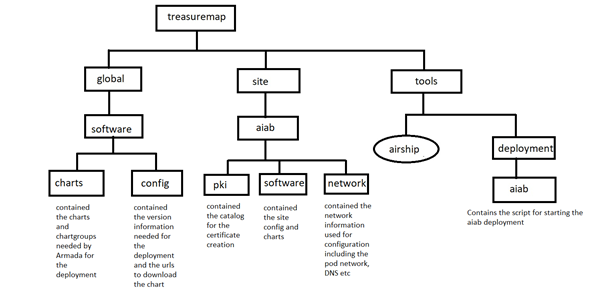
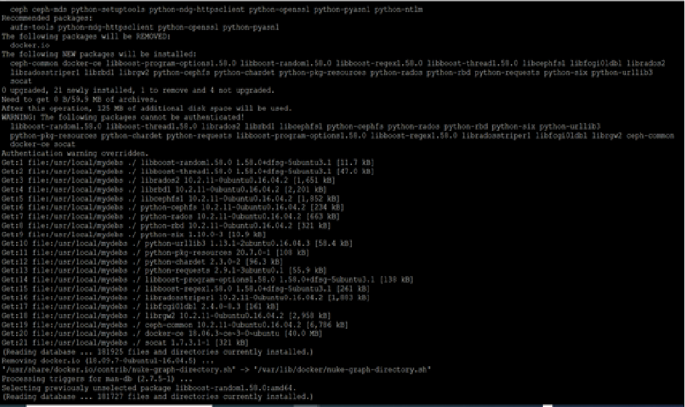
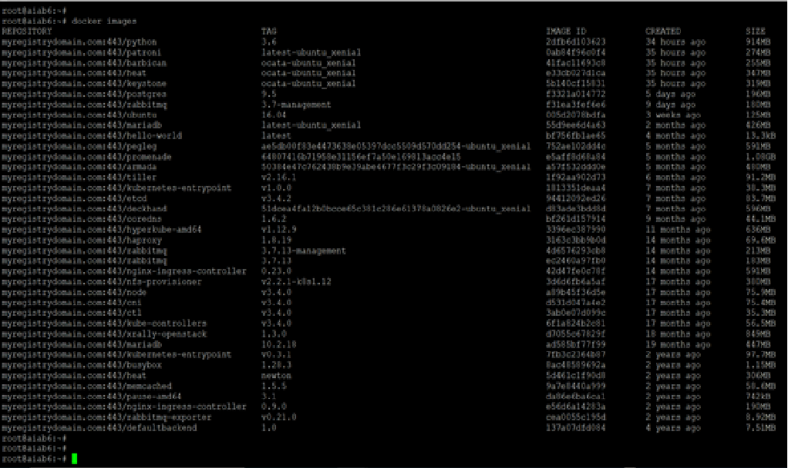

# Airship in a Bottle

## Problem Statement

The activity was to be able to deploy “Airship in a Bottle” with following tasks to be completed while performing the activity: -
1. Use kubeadm, kubectl, kubeadm binaries. Don't use apt to install these packages.
2. Setup a local ubuntu repo to install other packages if required. Don't directly install packages from ubuntu mirrors or any other public repos.
3. Don’t use any docker images from public repos (e.g.: quay.io, dockerhub.com, gcr.io etc.). Setup a local docker images registry for docker images. 
4. Modify airship manifest(s) to use the docker images and other packages from local repos and registries.  
5. Write the script to automate whole process in any language (Golang is preferred though). Try to make the deployment as automated as possible.

Following link was provided: -

https://github.com/airshipit/treasuremap

## Activities

For this the planning was to perform the tasks independently first and once completed, to combine them as a complete solution. The critical area of this planning was to understand and then to be able to deploy the Airship in a bottle using the kubeadm.

Following are the tasks which were performed to accomplish the solution.

1.	The initial focus was to understand what Airship is and try to be familiar with the Treasure Map link provided. Main focus of this activity was to be able to deploy “Airship in a Bottle” using the kubeadm and define the procedure for it. After that combine it to use the local docker registry and local ubuntu repository. 
Various approaches undertaken to understand and deploy “Airship in a bottle” are covered under section Airship understanding and Deployment.
2.	A separate Cluster was also created using the kubeadm and kubectl binaries (without the usage of the apt to install the packages). Refer the section Cluster creation without using the Kubeadm Binaries for more details on the steps performed.
3.	Local Docker Registry was created on a separate machine and was used to refer for the docker images. Steps for creating the Docker Registry are captured under the section Docker Registry Creation.
4.	Local Ubuntu repository was also created comprising of all the packages required for the deployment of the Airship in a Bottle. For this dpkg-dev was used. Refer section Local Ubuntu Repository Creation for more details about the steps performed.
5.	Deployed the “Airship in a Bottle” using the method defined in the treasuremap, with access to the local docker registry and Local Ubuntu Repository. Refer to section Airship in a Bottle using local docker registry and Ubuntu Repository for the steps executed and changes done to make it run.

## Airship understanding and Deployment

This activity was started by referring to the GIT link shared for the treasure map https://github.com/airshipit/treasuremap.
From this link, the documentation was opened and was used to make the early understanding of the Airship, its components and number of deployment strategies like Seaworthy, Airloop and Airskiff. (Link referred is https://airship-treasuremap.readthedocs.io/en/latest/index.html)

During the documentation only came across the link referring to the document for the Airship in a Bottle (https://github.com/airshipit/treasuremap/blob/master/tools/deployment/aiab/README.rst).

Based on the “aiab” link and information gathered through the documentation tried to deploy the Airship in a Bottle using the details present in the TreasureMap.

### “Airship in a Bottle” Deployment using the TreasureMap

NOTE: - In this task Local Ubuntu repository or the Docker Registry was not used.

First Iteration: -
1.	A VM was created with Ubuntu 16.04, having 2 vCPUs, 4 GB RAM, 30 GB storage. 
NOTE: - I had read the minimum specification mentioned but due to limited resources on the laptop, and other activities being done in parallel, I could only spare 4 GB RAM and 2 vCPUs. As main idea was to see how it works.
2.	Script airship-in-a-bottle.sh was modified to by-pass the configuration related checks.
3.	Using the root user, executed the script “./airship-in-a-bottle.sh” located at /root/deploy/treasuremap/tools/deployment/aiab/
4.	It was observed the script started well but during the deployment of the chart ingress-kube-system it got stuck.

Second Iteration: -
1.	A VM was created with Ubuntu 16.04, having 4 vCPUs, 9 GB RAM, 30 GB storage. 
NOTE: - This is the maximum RAM I could provide due to limited resources.
2.	Script airship-in-a-bottle.sh was modified to by-pass the configuration related checks.
3.	Using the root user, executed the script “./airship-in-a-bottle.sh” located at /root/deploy/treasuremap/tools/deployment/aiab/
4.	It was observed the script started well but during the deployment of the ChartGroup: ucp-deckhand it got error.
5.	The logs captured were studied and it was identified that mariadb-ingress POD was restarting which caused the time-out issues.
6.	Since one of the reasons could be the resources as RAM (as I was off the minimum requirement) was low so did not analyze further.

NOTE: - Post the second iteration, since the execution went ahead and deployed multiple charts, backup of the generated files was taken, so that it can referred or used later.

### Code and captured logs Understanding

Next, I tried to understand airship-in-a-bottle.sh to understand what exactly was happening under the hood.
Following is my understanding: -
1.	“airship-in-a-bottle.sh” checked for the minimum configuration and picked up the information like hostname, interface, IP address etc and invoked the second script “deploy-airship.sh”
2.	“deploy-airship.sh” did the following: -
	a.	It installed the docker.io, related dependencies and configure the docker.
	b.	PEGLEG was invoked to aggregate all the artifacts into a single file which could later be used to deploy the airship in a bottle. It resulted in a “treasuremap.yaml” inside the folder collected.
	c.	PROMENADE is used to first create all the required certificates and store them under the folder genesis in the file name “certificates.yaml”.
	d.	PROMENADE is now used to generate the genesis.sh which in tern will use the created “certificates.yaml” and “treasuremap.yaml”
	e.	Post the generation of genesis.sh, it is executed which will: -
		i.	Place the segregated certificates, charts to be used.
		ii.	Place the static pod yaml files to start the control node pods
		iii.	These static pods also include the pods to deploy armada bootstrapping and auxiliary ETCD. 
		iv.	Start the kubelet. 
		v.	Bootstrap armada deploys the aiab using the information as present in the manifest.yaml which is created from the treasuremap.yaml and placed at location “/etc/genesis/armada/assets/”
NOTE: Bootstrap Armada, is responsible for the deployment of the kubernetes control plane pods, networking, UCP components like promenade, armada, barbican, deckhand etc.

### Treasuremap Folder Structuring

A high-level folder structure (not covering all the files) was created so that it is easy to track the files as moved forward. (It was mostly focused from the point of Airship in a Bottle)
For this PEGLEG documentation was also read to get more clarity: -

https://airshipit.readthedocs.io/projects/pegleg/en/latest/getting_started.html

This is not extensive but gives a high-level view.

 
### Solution Approach 1

For this I did the following tasks: -
1.	Created an Ubuntu 16.04 VM, 4 vCPUs, 9GB RAM, 32 GB storage
2.	Created a manager node using the kubeadm. (No worker node was deployed) For this used the same approach as stated in section Cluster creation without using the Kubeadm Binaries.
3.	Executed “airship-in-a-bottle.sh” till the point genesis.sh is created.
4.	Executed the genesis.sh till the time all the files are extracted and placed at the desired location, including the manifest.yaml used by the Armada and other public and private keys etc.

Challenges faced during this approach were: - 

1.	At this point, genesis also places the control node manifests like Kubernetes-apiserver, Kubernetes-controller-manage, Kubernetes-scheduler and Kubernetes-etcd also which were created by the Promenade (deployed as Static Pods).

Solution: - Since the files added by the Genesis.sh did not deploy the running pod as the port was already used, hence those manifests were removed.

2.	After fixing the above issue, I observed that the Bootstrap armada pod was not running.

Solution: - I debugged and saw that it had 4 containers: - 
a.	Tiller
b.	Armada
c.	Monitor
d.	API-Server
This API server was running on port 6444 and was pointing to the wrong ETCD endpoint as it was looking for the port 12379 and 22379 whereas the etcd deployed by the kubeadm was running on the 2379. Also, certificate issue was also there. Fixed that, now POD was running but still Armada was not deploying anything.

3.	On the Re-Execution of the same approach, I realized the real reason for the problem 2 was that auxiliary ETCD static POD was not deployed. This time I had used the modified version of the Bootstrap Armada with different certificates and few more changes which I had done earlier to have a work-around problem 2, hence there was a TLS handshaking issue.

Solution: - This approach was left as it was still using PROMENADE and due to mid-run of the existing tools, there was a chance that system may get corrupted.

### Further understanding building

Just to understand more on how PROMENADE and ARMADA works, searched for their operational documents and read through it to get more information about them.
Following links were read for this purpose
1.	https://airshipit.readthedocs.io/projects/armada/en/latest/readme.html
2.	https://airshipit.readthedocs.io/projects/promenade/en/latest/index.html

Along with this a You-Tube video (from a 2018 conference) was also referred to increase the further understanding on the airship.

https://youtu.be/ckcLnBqGQrQ

### Solution Approach 2

In this one, I removed the usage of “airship-in-a-bottle.sh” and PROMENADE. I tried to deploy the cluster (with HELM2) and then deploy the bootstrap armada using the old manifests (saved using the initial days for reference).

Following steps were performed: -
1.	Created an Ubuntu 16.04 VM, 4 vCPUs, 9GB RAM, 32 GB storage
2.	Created a manager node using the kubeadm. (No worker node was deployed) For this used the same approach as stated in section Cluster creation without using the Kubeadm Binaries.
3.	On this Node, all the taints were removed, and now the HELM 2 was deployed.
4.	A Service account was created for the Tiller and was initiated using the 
$ helm init –service-account tiller
5.	In this bootstrap armada pod definition was modified to use only two containers: -
	a.	Armada
	b.	Monitor
Armada container was modified to connect with the Tiller that came with the HELM2.
6.	The chart group “cluster-bootstrap-aiab” in the manifest.yaml used by Armada container was modified. Following chart groups were removed: -
	a.	podsecuritypolicy
	b.	kubernetes-proxy
	c.	kubernetes-container-networking
	d.	kubernetes-dns
	e.	kubernetes-etcd
	f.	kubernetes-haproxy
	g.	kubernetes-core
7.	On analyzing all the remaining members (and their dependencies as mentioned in the manifest.yaml) of the chart group “cluster-bootstrap-aiab “, could not find the dependency on the certificated. 
8.	Created the new private key and certificate for the Armada (at location /etc/genesis/armada/auth/pki/) and updated kubeconfig file (at location /etc/genesis/armada/auth) as well so that using the “armada” user cluster could be accessed. 
9.	Step 8 was repeated for armada-cli as well at location /etc/genesis/armada-cli/auth/pki/ and /etc/genesis/armada-cli/auth respectively

Challenges faced during this approach were: - 
1.	On looking at the logs generated by the Armada (at location /var/log/armada/bootstrap-armada.log) following errors were observer: -
2020-05-19 17:04:39.628 8 ERROR armada.cli   File "/usr/local/lib/python3.5/dist-packages/urllib3/util/ssl_.py", line 358, in ssl_wrap_socket
2020-05-19 17:04:39.628 8 ERROR armada.cli     context.load_cert_chain(certfile, keyfile)
2020-05-19 17:04:39.628 8 ERROR armada.cli ssl.SSLError: [SSL] PEM lib (_ssl.c:2829)

Solution: - To overcome this following thing were done:
a.	Referred the following link and checked for the openssl version was it over 1.0. and it was observed that “urllib3” was not present.
https://airshipit.readthedocs.io/projects/armada/en/latest/operations/guide-troubleshooting.html
b.	Along with “urllib3”, there were some dependent python packages that were needed. Referred to the old captured logs and saw few of them were installed by the genesis.sh. So installed all of them.
c.	Still the error persisted, and it was later identified that the armada public key was not correctly generated. On creating it again, it worked.

2.	Armada started the deployment of the first chart group “ingress-kube-system” but it timed-out. On looking at the pod status, it was in pending state.

Solution: - In this case scheduler pod was still in running state. So, looked at the description of the pod to understand the reason for not being deployed. 
The reason was nodeSelector had failed to select the node.
Then looking into genesis.sh, it was identified that a label was applied to ensure where exactly pod gets deployed. Hence following command was executed.
$ kubectl label node <node_name> --overwrite beta.kubernetes.io/fluentd-ds-ready=true calico-etcd=enabled kube-dns=enabled kube-ingress=enabled kubernetes-apiserver=enabled kubernetes-controller-manager=enabled kubernetes-etcd=enabled kubernetes-scheduler=enabled promenade-genesis=enabled ucp-control-plane=enabled maas-rack=enabled maas-region=enabled openstack-control-plane=enabled openvswitch=enabled openstack-l3-agent=enabled node-exporter=enabled fluentd=enabled openstack-control-plane=enabled openstack-nova-compute=enabled openstack-libvirt=kernel utility=enabled

3.	After the deployment of the second chart group “osh-infra-nfs-provisioner” it again got stuck with the following error from the armada: - 

Solution: -
Could not fix this. Thought that may be because of the older chart groups skipped. So, went to approach 3.

### Solution Approach 3

This one is the same as Approach 2, with the following differences 
1.	Chart group “cluster-bootstrap-aiab” has not been modified.
2.	Unchanged bootstrap armada Pod and auxiliary ETCD pod have been used.
New certificated were created for the first few chart group members of “cluster-bootstrap-aiab”, to see the behavior.

Challenge faced: -
1.	On deployment of the bootstrap armada and auxiliary ETCD static pods, following error is observed: -
2020-05-20 11:40:49.350 10 ERROR armada.cli [-] Caught unexpected exception: urllib3.exceptions.MaxRetryError: HTTPSConnectionPool(host='localhost', port=6444): Max retries exceeded with url: /apis/armada.process/v1/namespaces/kube-system/locks (Caused by NewConnectionError('<urllib3.connection.VerifiedHTTPSConnection object at 0x7f43e4bfb908>: Failed to establish a new connection: [Errno 111] Connection refused',))
2020-05-20 11:40:49.350 10 ERROR armada.cli Traceback (most recent call last):
2020-05-20 11:40:49.350 10 ERROR armada.cli   File "/usr/local/lib/python3.5/dist-packages/urllib3/connection.py", line 157, in _new_conn
2020-05-20 11:40:49.350 10 ERROR armada.cli     (self._dns_host, self.port), self.timeout, **extra_kw
2020-05-20 11:40:49.350 10 ERROR armada.cli   File "/usr/local/lib/python3.5/dist-packages/urllib3/util/connection.py", line 84, in create_connection
2020-05-20 11:40:49.350 10 ERROR armada.cli     raise err
2020-05-20 11:40:49.350 10 ERROR armada.cli   File "/usr/local/lib/python3.5/dist-packages/urllib3/util/connection.py", line 74, in create_connection
2020-05-20 11:40:49.350 10 ERROR armada.cli     sock.connect(sa)
2020-05-20 11:40:49.350 10 ERROR armada.cli ConnectionRefusedError: [Errno 111] Connection refused

Solution: - This one still needs to be debugged.

## Cluster creation without using the Kubeadm Binaries

### Pre-Requisite

1.	2 Ubuntu 16.04 virtual machines, with 2 GB RAM, 2 vCPUs and 10 GB storage
2.	Host Network configured with SSH daemon running
3.	Packages like curl are installed on the machine.

NOTE: - Since this task was tested initially as a stand-alone hence the dependent packages were installed from the Ubuntu mirror and not from the Local Repository

### Steps Performed

1.	Switch to the root user.
$ sudo su -

2.	Swap was turned off
$ swapoff -a

3.	Install the docker.io package using the following command.
$ apt-get install docker.io

4.	All the dependent packages were installed
$ apt-get install iproute2 socat util-linux mount ebtables ethtool conntrack

5.	Create a folder for the storing the binaries
$ mkdir kube_binaries
$ cd kube_binaries

6.	Download the required binaries and install them
$ curl -LO https://packages.cloud.google.com/apt/pool/kubernetes-cni_0.7.5-00_amd64_b38a324bb34f923d353203adf0e048f3b911f49fa32f1d82051a71ecfe2cd184.deb
$ dpkg -i kubernetes-cni_0.7.5-00_amd64_b38a324bb34f923d353203adf0e048f3b911f49fa32f1d82051a71ecfe2cd184.deb

$ curl -LO https://packages.cloud.google.com/apt/pool/kubelet_1.18.2-00_amd64_1fb09333a48950c243d165ba9b4989a99ad8130d135d8b18e72bcb151359d6fe.deb
$ dpkg -i kubelet_1.18.2-00_amd64_1fb09333a48950c243d165ba9b4989a99ad8130d135d8b18e72bcb151359d6fe.deb

$ curl -LO https://packages.cloud.google.com/apt/pool/kubectl_1.18.2-00_amd64_89df64c5d736fa79e5a9754d94541b02c29f52d6d5720dbb3d58e22406a969f5.deb
$ dpkg -i kubectl_1.18.2-00_amd64_89df64c5d736fa79e5a9754d94541b02c29f52d6d5720dbb3d58e22406a969f5.deb

$ curl -LO https://packages.cloud.google.com/apt/pool/cri-tools_1.13.0-00_amd64_6930e446a683884314deef354fbd8a7c5fc2be5c69c58903ad83b69b42529da4.deb
$ dpkg -i cri-tools_1.13.0-00_amd64_6930e446a683884314deef354fbd8a7c5fc2be5c69c58903ad83b69b42529da4.deb

$ curl -LO https://packages.cloud.google.com/apt/pool/kubeadm_1.18.2-00_amd64_bcaf195a62edb4ecb8040035e57a7dab692c962471eb47afa527ae14d8af5ecf.deb
$ dpkg -i kubeadm_1.18.2-00_amd64_bcaf195a62edb4ecb8040035e57a7dab692c962471eb47afa527ae14d8af5ecf.deb
7.	Initialize the cluster
$ kubeadm init --apiserver-advertise-address=<advertised_ip_address> --pod-network-cidr=10.97.0.0/16
8.	Perform the steps mentioned at the end of above command
$ mkdir -p $HOME/.kube
$ sudo cp -i /etc/kubernetes/admin.conf $HOME/.kube/config
$ sudo chown $(id -u):$(id -g) $HOME/.kube/config

9.	Deploy the Calico Pod Network
$ kubectl apply -f https://docs.projectcalico.org/v3.14/manifests/calico.yaml

On the Second Node: - 
10.	Repeat 1-6 steps mentioned above.
11.	Use the Join token provided at the end of the kubeadm init command on the master node to join the cluster.
$ kubeadm join <advertised_ip_address>:6443 --token wp66b3.98dp7tyxc7ywlkzn \
    --discovery-token-ca-cert-hash sha256:2102b2d2eef22404904f24430a816e48d064a705ae1ab997d66038144a13865a

On the Master node
12.	Execute the following command to observe if the nodes have joined the cluster and are in Ready state.
$ kubectl get nodes

## Docker Registry Creation

### Pre-Requisite
1.	1 Ubuntu 16.04 virtual machine, with 2 GB RAM, 2 vCPUs and 32 GB storage
2.	1 Ubuntu 16.04 virtual machine, with 2 GB RAM, 2 vCPUs and 10 GB storage
3.	Host Network configured with SSH daemon running
4.	Packages like curl are installed on the machine.
NOTE: - Since this task was tested initially as a stand-alone hence the dependent packages were installed from the Ubuntu mirror and not from the Local Repository

### Steps Performed

Login to the machine with 32 GB Storage option.
1.	Switch to the root user.
$ sudo su –

2.	Install the docker.io package using the following command.
$ apt-get install docker.io

3.	Create the self-signed certificates
$ mkdir -p certs
$ openssl req -newkey rsa:4096 -nodes -sha256 -subj “/CN=myregistrydomain.com” -keyout certs/domain.key -x509 -days 365 -out certs/domain.crt

4.	Place the certificate at the following location for the verification
	$ cp certs/domain.crt /etc/docker/certs.d/myregistrydomain.com:443/ca.crt
	NOTE: We need to copy the domain.crt on all the Docker nodes from where we need to access this docker registry.
5.	Start the registry and directing it to the TLS certificate created above.
	$ docker run -d \
  --restart=always \
  --name registry \
  -v "$(pwd)"/certs:/certs \
  -e REGISTRY_HTTP_ADDR=0.0.0.0:443 \
  -e REGISTRY_HTTP_TLS_CERTIFICATE=/certs/domain.crt \
  -e REGISTRY_HTTP_TLS_KEY=/certs/domain.key \
  -p 443:443 \
 registry:2 
6.	Add an entry in the /etc/hosts file for the myregistrydomain.com to point to the current node.
	$ cat /etc/hosts
127.0.0.1       localhost
127.0.1.1       dockerRegistry
<IP address>  myregistrydomain.com
NOTE: We need to add an entry for the myregistrydomain.com on all the docker nodes from where we need to access the local registry. And IP address would be for the machine which is hosting the registry.

### Insert a Docker image in the local registry

Login to the machine hosting the docker registry
1.	Login to docker registry created above
$ docker login myregistrydomain.com:443
Username: root
Password: 
WARNING! Your password will be stored unencrypted in /root/.docker/config.json.
Configure a credential helper to remove this warning. See
https://docs.docker.com/engine/reference/commandline/login/#credentials-store

Login Succeeded

2.	Create the entry for ubuntu:16.04 image in the myregistrydomain.com:443 docker repository
$ docker pull ubuntu:16.04
$ docker tag ubuntu:16.04 myregistrydomain.com:443/my-ubuntu
$ docker push myregistrydomain.com:443/my-ubuntu
$ docker image rm myregistrydomain.com:443/my-ubuntu
$ docker image rm ubuntu:16.04
$ docker pull myregistrydomain.com:443/my-ubuntu

### Testing of the Registry

Login to the second machine with 10 GB storage
1.	Switch to the root user.
$ sudo su –

2.	Install the docker.io package using the following command.
$ apt-get install docker.io

3.	Login to docker
$ docker login myregistrydomain.com:443
Username: root
Password: 
WARNING! Your password will be stored unencrypted in /root/.docker/config.json.
Configure a credential helper to remove this warning. See
https://docs.docker.com/engine/reference/commandline/login/#credentials-store

Login Succeeded

4.	Try to pull the ubuntu:16.04 image from the local repository
$ docker pull myregistrydomain.com:443/my-ubuntu

## Local Ubuntu Repository Creation

### Pre-Requisite

1.	1 Ubuntu 16.04 virtual machine, with 2 GB RAM, 2 vCPUs and 10 GB storage
2.	Host Network configured with SSH daemon running
3.	Packages like curl are installed on the machine.
4.	Access to the machine and captured logs where “Airship in a Bottle” Deployment using the TreasureMap was executed.

### Steps Performed

1.	Switch to the root user.
$ sudo su –

2.	Create a folder for storing all the packages required for the deployment of the “Airship in a Bottle” 
$ mkdir -p /usr/local/mydebs

3.	Copy all the packages used for the “Airship in a Bottle” deployment in the above-mentioned directory.
NOTE: - Most of the packages were already present at the location /var/cache/apt/archives on the machine where “Airship in a Bottler” was first executed using the treasuremap.
Following this, captured logs were studied to identify packages which are required but not present in the /var/cache/apt/archives location.

4.	Once all the packages were collected following commands were executed:
$ cd /usr/local/mydebs
$ dpkg-scanpackages . /dev/null | gzip -9c > Packages.gz

5.	Now sources.list file was updated to contain only the following entry.
	$ cat /etc/apt/sources.list
deb file:/usr/local/mydebs ./
6.	Once the sources.list is updated, apt-get was also updated. 
	$ apt-get update
With this the packages present in the mydebs can be installed in the offline mode as well.

## Airship in a Bottle using local docker registry and Ubuntu Repository

### Pre-Requisite

1.	1 Ubuntu 16.04 virtual machine, with 4 GB RAM, 9 vCPUs and 32 GB storage for Airship deployment.
2.	1 Ubuntu 16.04 virtual machine, with 2 GB RAM, 2 vCPUs and 32 GB storage with a working local docker registry. (It was created using the steps mentioned in Docker Registry Creation section.
3.	Host Network configured with SSH daemon running
4.	Packages like curl are installed on the machine.
5.	Local Ubuntu Repository folder. As created in the section Local Ubuntu Repository Creation.

### Steps Performed

1.	Switch to the root user.
$ sudo su –

2.	Place the mydebs directory (which was created as per Pre-Requisite #5) at the location /usr/local/mydebs.

3.	Update the sources.list file was updated to contain only the following entry.
	$ cat /etc/apt/sources.list
deb file:/usr/local/mydebs ./
4.	Once the sources.list is updated, apt-get was also updated. 
$ apt-get update

5.	Install the docker.io package using the following command.
$ apt-get install docker.io
NOTE: - This package will be installed using the /usr/local/mydebs location.

7.	Add an entry in the /etc/hosts file for the myregistrydomain.com to point to the node hosting the docker registry.
	$ cat /etc/hosts
127.0.0.1       localhost
127.0.1.1       dockerRegistry
<IP address>  myregistrydomain.com

6.	Fetch the ca.crt file from the location /etc/docker/certs.d/myregistrydomain.com:443/ on the node hosting the docker registry and store at the location /etc/docker/certs.d/myregistrydomain.com:443/ 
	$ cp ca.crt /etc/docker/certs.d/myregistrydomain.com:443/ca.crt

7.	Login to docker
$ docker login myregistrydomain.com:443
Username: root
Password: 
WARNING! Your password will be stored unencrypted in /root/.docker/config.json.
Configure a credential helper to remove this warning. See
https://docs.docker.com/engine/reference/commandline/login/#credentials-store

Login Succeeded

8.	Fetch the Treasuremap from the GIT
$ mkdir -p /root/deploy
$ cd /root/deploy
$ git clone https://github.com/airshipit/treasuremap.git

9.	Change the working directory
$ cd treasuremap/tools/deployment/aiab/

10.	Execute airship-in-a-bottle.sh
$ ./airship-in-a-bottle.sh 

Challenges faced: -
1.	The packages were not getting installed using the local ubuntu repository since the packages needed authentication.
Solution: - For this, following files were modified to include the flag “--allow-unauthenticated” wherever apt command was invoked for installing the packages.
a.	tools/deployment/aiab/common/deploy-airship.sh
b.	tools/airship

The apt-get install command for docker-ce and socat is also invoked from the genesis.sh. Was unable to locate the location from where the command was being created and written in genesis.sh, so applied a hack in the “deploy-airship.sh” to sleep for 100 seconds and in the mean time manually added the flag.

2.	The control landed in a waiting state to get API response with the cluster. 
Solution: - It was observed that no docker container was deployed and kubelet was also active. Also, the static pod manifests were also placed at location /etc/kubernetes/manifests.
On further debugging it was observed that /etc/hosts file get updated by promenade, hence the entry for the myregistydomain.com (out local docker registry) was removed. 
On adding the entry, it proceeded further with the deployment.

Following are some screen shots captured while using the local ubuntu repository and docker registry.
 

 

 

